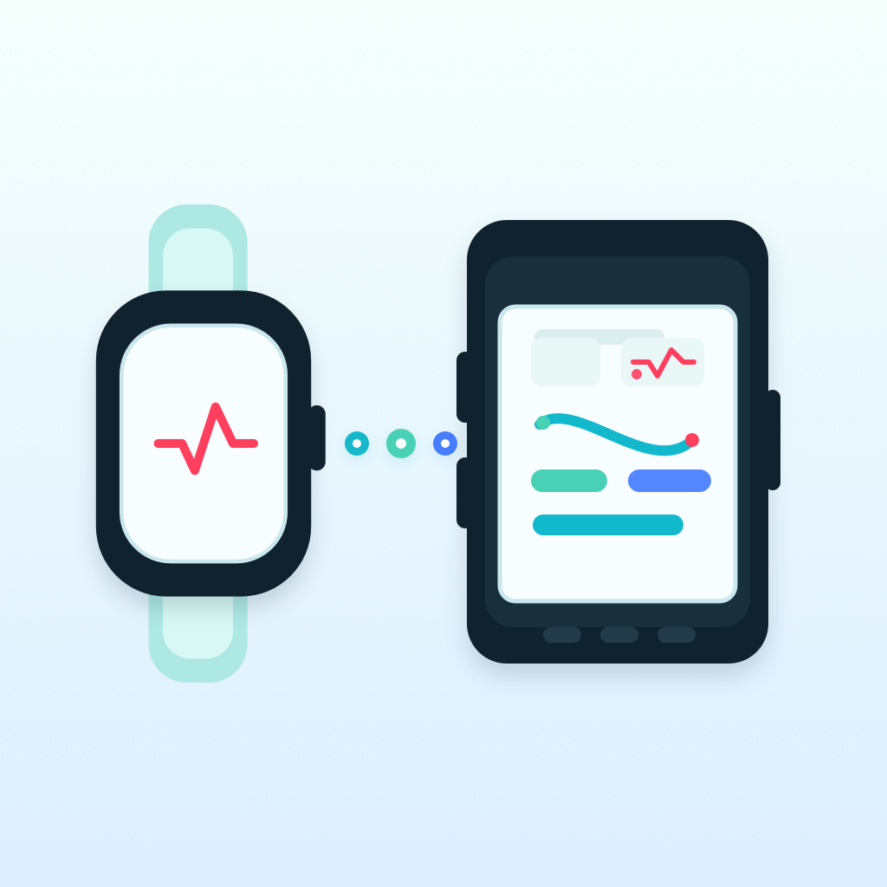
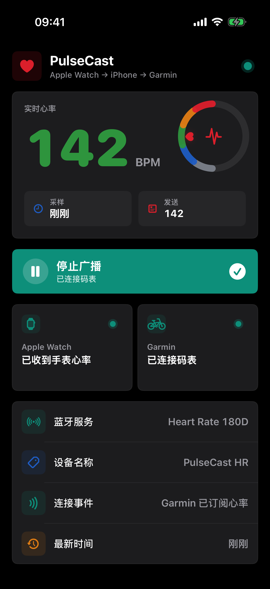
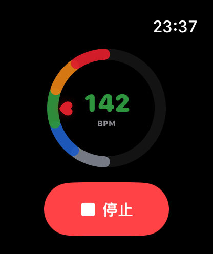

# PulseCast

<p align="center">
  
</p>

<p align="center">
  <strong>把 Apple Watch 的实时心率广播给支持标准 BLE 心率传感器的码表。</strong>
</p>

<p align="center">
  <sub>iOS 17+ · watchOS 10+ · SwiftUI · HealthKit · Bluetooth LE</sub>
</p>

PulseCast 由 Apple Watch 采集实时心率，借助 iPhone 转换成标准 Bluetooth LE Heart Rate Service。码表会把 iPhone 识别为名为 `PulseCast HR` 的蓝牙心率传感器。

## 界面预览

<table>
  <tr>
    <th align="center">iPhone：广播控制与连接状态</th>
    <th align="center">Apple Watch：实时心率采集</th>
  </tr>
  <tr>
    <td align="center" valign="top">
      
    </td>
    <td align="center" valign="top">
      
    </td>
  </tr>
</table>

<p align="center"><sub>截图使用 142 BPM 演示数据，仅用于展示界面；实际运行时显示 Apple Watch 采集的实时心率。</sub></p>

## 工作方式


1. Apple Watch App 在一次 cycling workout 中持续读取心率。
2. Watch 通过 WatchConnectivity 把心率样本发送到 iPhone。
3. iPhone 使用 Heart Rate Service (`180D`) 和 Heart Rate Measurement (`2A37`) 广播。
4. 码表搜索到 `PulseCast HR` 后，把 iPhone 作为蓝牙心率传感器连接。

公开 API 无法让 Apple Watch 直接成为码表可配对的 ANT+/BLE 心率带，因此实际链路是 `Apple Watch → iPhone → 码表`。广播采用标准 BLE 心率协议，其他支持该协议的设备也可以尝试连接。

## 核心能力

- Apple Watch 通过 HealthKit workout 获取更连续的实时心率
- iPhone 作为 BLE peripheral 广播标准心率服务
- 手机端集中展示当前 BPM、采样时间、广播值和两端连接状态
- 手机与手表均提供心率区间环形可视化
- 从 iPhone 请求唤醒 Watch App 并开始或停止采集
- 支持 `bluetooth-peripheral` 和 `workout-processing` 后台模式

## 需求

- iPhone + 已配对的 Apple Watch
- 支持蓝牙心率传感器的码表或其他设备
- Xcode，且包含 iOS 17 / watchOS 10 或更新 SDK
- XcodeGen：`brew install xcodegen`

## 生成工程

先把 `project.yml` 中的 bundle ID 改成自己的反域名，并同步修改 Watch App 的 companion bundle ID：

- `com.hongwei.wrist-pulse-cast`
- `com.hongwei.wrist-pulse-cast.watchkitapp`
- `App/PulseCastWatch/Info.plist` 中的 `WKCompanionAppBundleIdentifier`

然后生成并打开 Xcode 工程：

```sh
make generate
make open
```

在 Xcode 中选择自己的 Team，并确认：

- iPhone target 已启用 HealthKit、蓝牙权限和 `bluetooth-peripheral` background mode
- Watch target 已启用 HealthKit 和 `workout-processing` background mode

所需的 entitlement 和 `Info.plist` 配置已经包含在项目中。

## 安装到 Apple Watch

1. 用数据线把 iPhone 连接到 Mac，并解锁 iPhone 和 Apple Watch。
2. 在两台设备上开启开发者模式：`设置 → 隐私与安全性 → 开发者模式`。
3. 打开 Xcode 的 `Window → Devices and Simulators`，确认实体 Apple Watch 出现在设备列表中。
4. 选择 iPhone 真机运行 `PulseCast`；iPhone App 会携带并安装 Watch App。
5. 如果没有自动安装，可在 iPhone 的 Watch App 中手动安装 PulseCast。

如果 Watch App 提示 `This app could not be installed at this time`，优先确认手表已解锁、开启开发者模式，并且被 Xcode 识别且加入 provisioning profile。只识别到 iPhone 时，Watch 端安装会失败。

## 使用

1. 在 iPhone 上打开 PulseCast，点击“开始广播”。
2. 第一次使用时，在 Apple Watch 上完成 HealthKit 授权。
3. 等待手机端显示已收到手表心率并开始 BLE 广播。
4. 在码表中添加传感器，选择心率传感器并开始搜索。
5. 选择 `PulseCast HR` 完成连接。

## 限制

- 广播使用 BLE 心率服务，不是 ANT+。
- 实时性依赖 WatchConnectivity；iPhone App 在前台时最稳定。
- watchOS 不保证被请求唤醒的 App 一定显示在最前台，但可在后台处理 workout 配置并开始采集。
- iOS 支持 `bluetooth-peripheral` 后台模式，但后台广播和重新连接仍受系统调度限制；骑行前建议先让码表成功连接。
- 停止采集时会调用 `discardWorkout()`，避免在健康记录中保存一条占位 workout。
